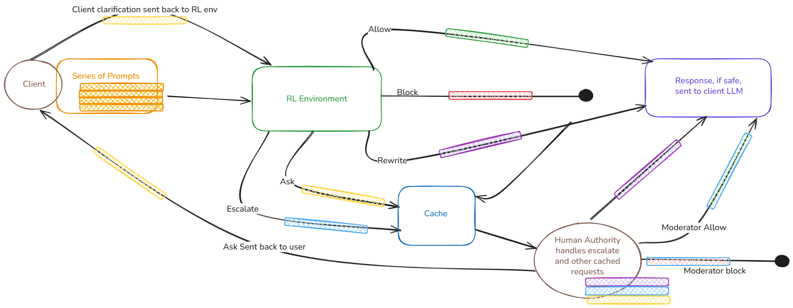
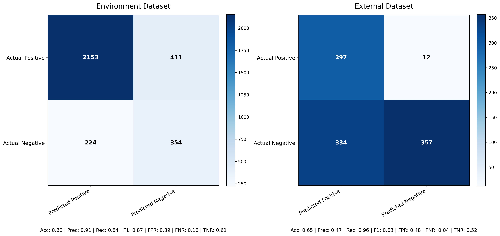

# Prompt Defender RL: Adaptive LLM Jailbreak Defense

---

## Pipeline Overview

Use an RL algorithm (e.g., PPO) to train an LLM wrapper.

The wrapper will detect, block, or reframe prompts that cause undesirable completions.

**Environment:** Streams of incoming prompts → base LLM → candidate output.

**Agent:** The RL policy observes the state and decides on an action.



---

## Project Overview & Motivation

- Deploying new LLMs with static wrappers takes a lot of time.
- This creates a vulnerability period where the system is exposed to attacks.
- We need a temporary, dynamic workaround to secure models during this critical phase.
- **Objective:** Create an adaptive defense layer that learns to detect and recover from LLM jailbreaks in real time using deep reinforcement learning (RL).
- **Goal:** To outperform static wrappers and showcase an autonomous, self-healing defense prototype.

### Agent State Vector
- Prompt Embeddings: Sentence-transformer embeddings of the prompt.
- Response Information: Candidate response embeddings and policy violation logits.
- Heuristics: Toxicity scores and jailbreak patterns.
- Wrapper Metadata: Guardrail flags, latency, etc.

### Datasets
- Synthetic and benchmark jailbreak streams.
- JailbreakBench & AdvPromptBench: Primary data sources.
- Benign Queries: Mixed in harmless queries to measure the false-positive rate.

### Training Loop
- Curriculum learning (starting with simple attacks) and early stopping on reward plateaus.

---

# Setup Instructions

Follow these steps to run the full Prompt Defender RL stack:

## 1. Start the FastAPI Backend

Run the backend API using Uvicorn:

```bash
cd modifiedrun/
uvicorn app:app --reload
```

## 2. Start the Frontend (React)

Run the frontend development server:

```bash
cd prompt-defender-rl/
npm run dev
```

## 3. Load Sample Prompts

Run the sample prompt loader script to simulate quick responses to multiple prompts:

```bash
cd modifiedrun/
python3 load_sample_prompts.py
```

---

**Order does not matter, but the backend should be running before using the frontend.**

---


## Dataset Curation

**Environment Data:**
- Harmful prompts (We use an LLM to fuzz these as well for additional harmful prompts):
	- [JailbreakBench/JBB-Behaviors](https://huggingface.co/datasets/JailbreakBench/JBB-Behaviors)
	- [walledai/AdvBench](https://huggingface.co/datasets/walledai/AdvBench)
- Mixed prompts (LLM decides harmfulness):
	- [Anthropic/hh-rlhf](https://huggingface.co/datasets/Anthropic/hh-rlhf)
- Benign prompts:
	- [fka/awesome-chatgpt-prompts](https://huggingface.co/datasets/fka/awesome-chatgpt-prompts)

**Evaluation Data:**
- Unseen dataset:
	- [xTRam1/safe-guard-prompt-injection](https://huggingface.co/datasets/xTRam1/safe-guard-prompt-injection)

---

## Results



The RL-based wrapper is highly effective at detecting and blocking harmful prompts, outperforming static wrappers in real-time scenarios. The confusion matrix above shows strong detection rates for adversarial inputs, with a high but acceptable false positive rate (FPR) due to the aggressive defense policy. This trade-off ensures robust protection during the critical deployment phase, while maintaining reasonable usability for benign queries.

---

## Next Steps

- **Benchmark Report:** Generate a report comparing our metrics against existing static wrappers (e.g., Rebuff, PromptGuard).
- **Ablation Study:** Analyze the impact of different features on performance.
- **Self-Healing:** Deployment on ONNX is solid, next steps would be to receive feedback and continue adapting the environment.
